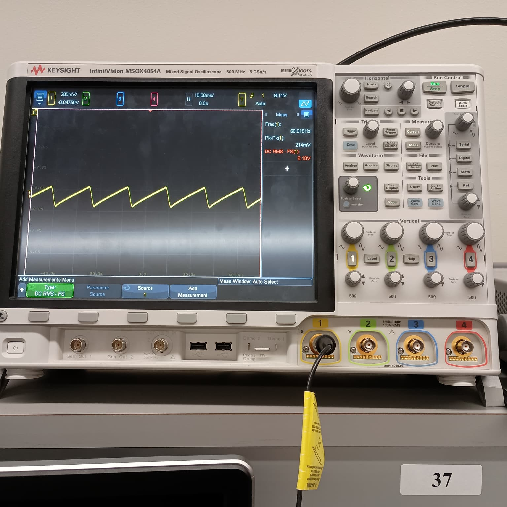
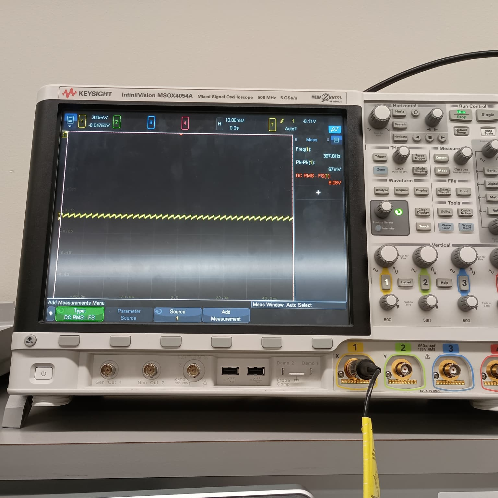
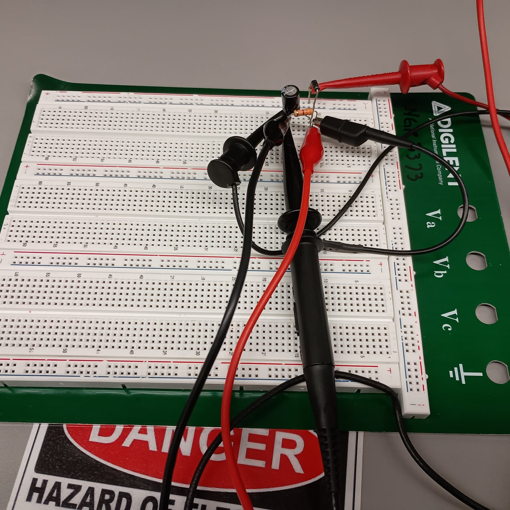
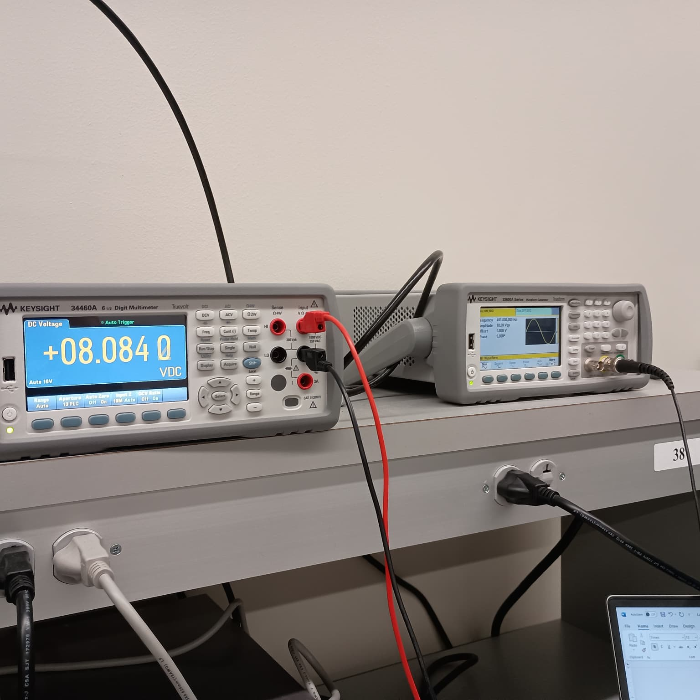

# 🧪 Diode Rectifier with Capacitor Filter

## 📝 Project Description
This small project explores how a simple **diode rectifier** can turn an AC signal into a DC voltage — and how adding a **capacitor filter** can smooth out the ripple. I started with a basic single-diode rectifier circuit, simulated the behavior, and then built it on a breadboard to compare theory, simulation, and real measurements.

I tested the circuit at two frequencies — **60 Hz** and **400 Hz** — to see how ripple voltage changes with frequency.

---

## ⚡ Circuit Details
- Diode: 1N4001  
- Load resistor (R<sub>L</sub>): 3.3 kΩ  
- Capacitor (C): 220 µF  
- Input source (V<sub>S</sub>): 10 V peak, sine wave  
- Function generator internal resistance (R<sub>S</sub>): 50 Ω (not added externally)

---

## 🧮 Expected Results
| Frequency | VDC (Predicted) | Vripple (Predicted) |
|-----------|-----------------|---------------------|
| 60 Hz     | 9.215 V         | 0.205 V             |
| 400 Hz    | 9.236 V         | 0.035 V             |

I expected a **larger ripple** at 60 Hz since the capacitor has more time to discharge between peaks.

---

## 🧰 Tools & Equipment
- Function Generator  
- Oscilloscope  
- Digital Multimeter  
- Breadboard & passive components






---

## 🧪 Real Measurements
| Frequency | VDC (Measured) | Vripple (Measured) |
|-----------|---------------|---------------------|
| 60 Hz     | 8.106 V       | 214 mV              |
| 400 Hz    | 8.084 V       | 67 mV               |

Even though the values are slightly lower than simulation, the **trend matched perfectly** — ripple is much lower at higher frequency.

---

## 📈 Observations & Notes
- The output waveform at 60 Hz showed a sawtooth ripple on top of the DC level.  
- At 400 Hz, the ripple was barely noticeable on the oscilloscope.  
- Capacitor filtering worked as expected.  
- Real readings were slightly lower due to component tolerances and internal resistance.

---

## 🧠 What I Learned
- How rectifiers and filters interact to shape AC into DC.  
- Why ripple voltage depends on frequency and capacitance.  
- How to use lab instruments (oscilloscope, DMM, function generator) to capture small ripple voltages.  
- That simulation is close to real life — but not exact.

---

## 📂 Repository Structure
```
Diode-Rectifier/
│
├─ README.md
├─ Images/
│   ├─ scope_waveform_60Hz.jpg
│   ├─ scope_waveform_400Hz.jpg
│   ├─ setup_breadboard.jpg
│   └─ instruments.jpg
├─ Simulation/
│   └─ Design1.ms14
├─ Data/
│   └─ measurements.xlsx
└─ Report/
    └─ Lab3 - Diode Rectifier.pdf
```


